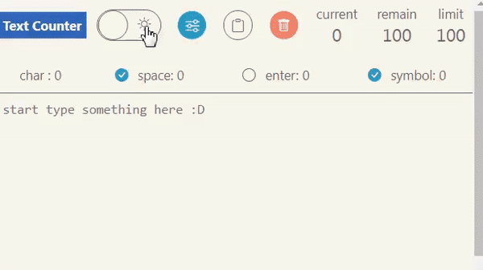
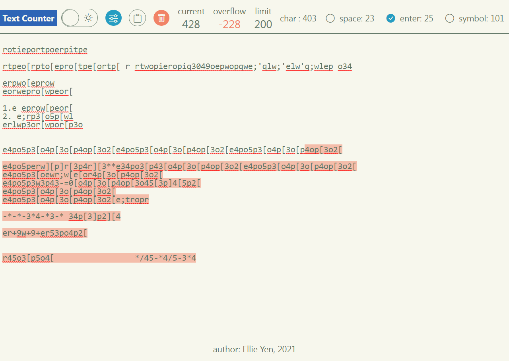

# Text-Counter

## A text counter for more flexible demands.
&#128204; [live demo link](https://ellie-yen.github.io/Text-Counter/)

* description:
Unlike most text counters, this text counter allow you to set restriction of words and decide whether symbols, enter(newline) and space should be counted. 
The overflow contents will be highlighten. Editing would become easier and flexible.

* techs:
  * To highlight the overflow texts, a div element is used underneath the textarea. This div element has same position and content to textarea but with highlighted texts. The *scroll event* of textatra would trigger the same behaviour of this div element, so the content appearance will be overlapped perfectly.

* source and liscense:
  * This project was bootstrapped with [Create React App](https://github.com/facebook/create-react-app).
